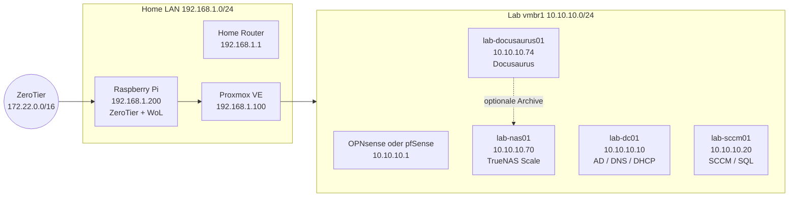

# Architektur-Übersicht

## Infrastrukturdiagramm



## Neue Infrastruktur

| Komponente | Technologie | Zweck |
|---|---|---|
| NAS | TrueNAS Scale mit ZFS | Zentraler Speicher, Shares und Backup-Ziel |
| Doku-Portal | Docusaurus 3 auf VM 127 | Eigenständige Dokumentation ohne Git-Plattform als Laufzeitabhängigkeit |
| Webserver der Doku-VM | Schlanker Nginx-Container | Auslieferung des statischen Docusaurus-Builds |

Die früheren dedizierten Nginx-Proxy-, Paperless- und GitLab-VMs gehören nicht zu diesem Branch.

## Datenpfade

```text
Repository-Update
    -> lab-docusaurus01
    -> Docker Build (Docusaurus)
    -> Nginx-Container (Veröffentlichung)

VM-Backups
    -> NAS backup-Share
    -> ZFS-Snapshots
```
