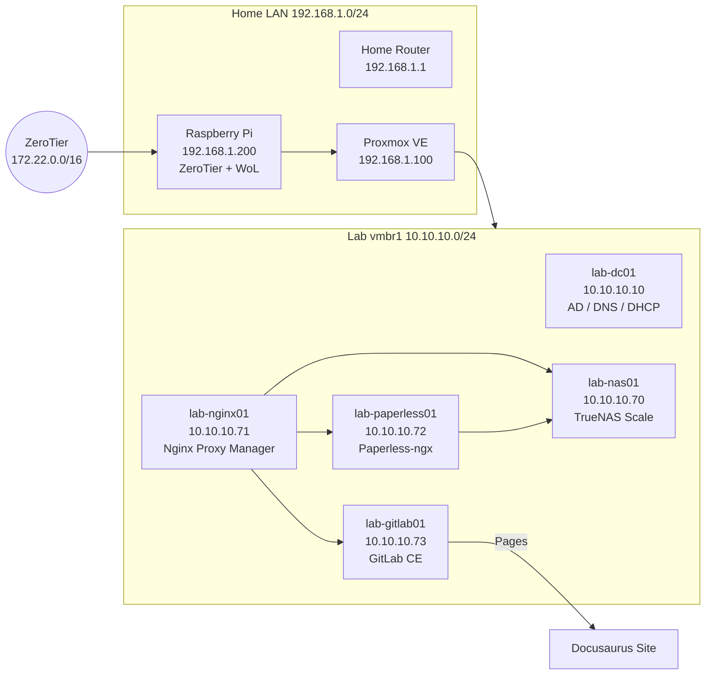

# Architektur-Übersicht

## Infrastrukturdiagramm



---

## Komponentenbeschreibung

| Komponente | Technologie | Zweck |
|---|---|---|
| Hypervisor | Proxmox VE 8.x | Führt alle VMs aus |
| Fernzugriff | ZeroTier + WoL (Raspberry Pi) | Remote-Zugang + Aufwecken des Hosts |
| NAS | TrueNAS Scale (ZFS) | Zentraler Dateispeicher, Backup-Ziel |
| Reverse Proxy | Nginx Proxy Manager (Docker) | HTTP-Routing, SSL-Terminierung |
| Dokumentenmgmt | Paperless-ngx (Docker) | OCR, Ablage, Suche |
| Source Control | GitLab CE (Docker) | Repos, CI/CD, Pages |
| Doku-Portal | Docusaurus 3 | Diese Seite |
| Domain | Windows Server 2022 AD DS | AD, DNS, DHCP für lab.local |

---

## Netzwerk

- **vmbr0** (`192.168.1.0/24`): Home LAN, Proxmox-Management
- **vmbr1** (`10.10.10.0/24`): Isoliertes Lab-Netz, alle VMs
- **ZeroTier** (`172.22.0.0/16`): Verschlüsseltes Overlay für Fernzugriff

Alle NAS/Services-VMs sitzen im selben Subnetz (vmbr1) wie die Windows-VMs. Nginx Proxy Manager ist der einzige Eintrittspunkt für HTTP-Traffic von außerhalb.

---

## Datenpfade

```
Scan → NAS consume-Share
    → Paperless (OCR + Index)
    → NAS media-Share (Archiv)

Git push
    → GitLab CE
    → GitLab CI (Docusaurus build)
    → GitLab Pages (Veröffentlichung)

VM-Backups
    → NAS backup-Share (ZFS, Snapshots)
```
