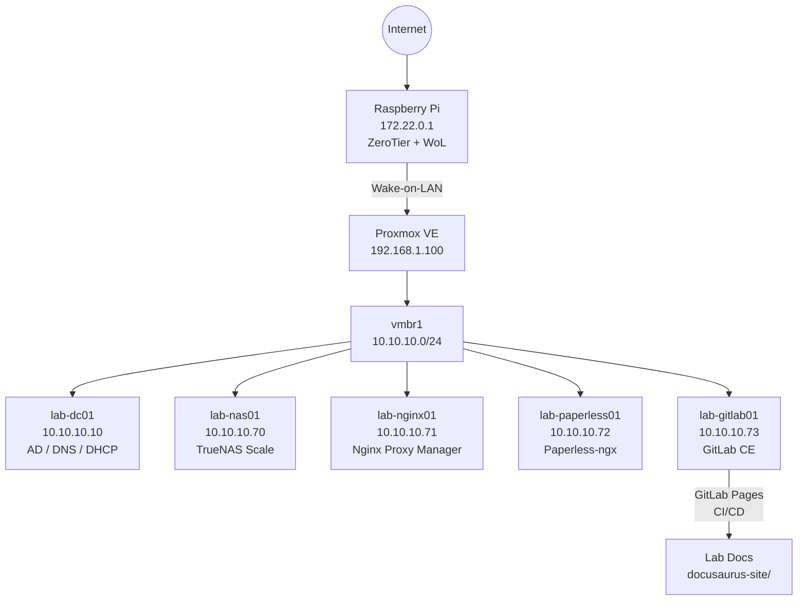

# Lab Docs

Willkommen im Dokumentationsportal des **ProxmoxInfra Home Lab**.

Diese Seite dient als Knowledge Base, Projektdokumentation und Designarchiv. Sie wird automatisch aus dem GitLab-Repository gebaut und über GitLab Pages veröffentlicht.

---

## Lab-Infrastruktur

---

## Schnellzugriff

| Service | URL | Beschreibung |
|---|---|---|
| GitLab | http://10.10.10.73 | Quellcode, Issues, CI/CD |
| Paperless | http://10.10.10.72:8000 | Dokumentenmanagement |
| TrueNAS | http://10.10.10.70 | NAS, ZFS, Shares |
| Nginx | http://10.10.10.71:81 | Reverse Proxy Admin |
| Proxmox | https://192.168.1.100:8006 | Hypervisor |

---

## Dokumentationsstruktur

- **Produkt** — Vision, Roadmap, User Stories
- **Design** — Claude Design Exports, Designsystem, Prototypen
- **Architektur** — Übersicht, Architecture Decision Records (ADRs)
- **API** — API-Dokumentation
- **Runbooks** — Betriebliche Anleitungen und Checklisten
